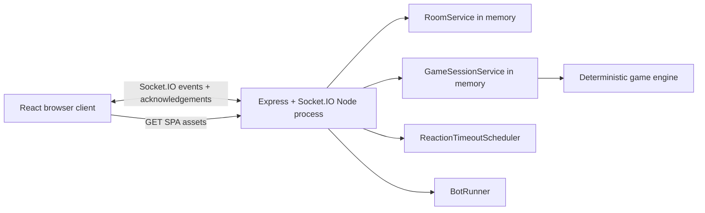
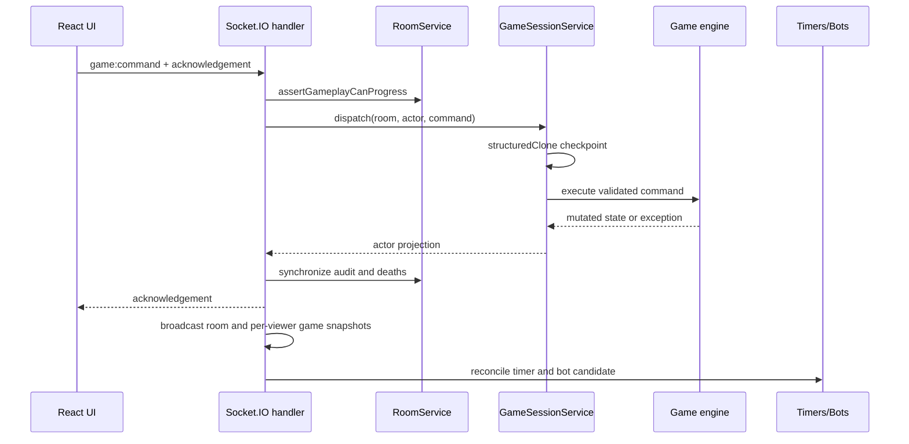

# Application architecture

Status: current implementation, documented July 2026.

This document covers the room, server, transport, browser client, bot, timer,
and deployment layers. The deterministic game rules are described separately
in [game-engine-architecture.md](game-engine-architecture.md).

## Runtime overview

The production application is one Node.js process:

There is no server-side React rendering. Vite builds a client-rendered SPA into
`dist`. In production Express serves those static assets and returns
`dist/index.html` for non-API, non-Socket.IO navigation so invite URLs such as
`/ABCDEF` work on refresh.

During development, Vite serves the browser client and proxies `/socket.io` to
the Node server on port 3000.

## Process entry and deployment

`src/server/start.ts` reads:

- `PORT`, defaulting to `3000`;
- `HOST`, defaulting to `0.0.0.0`;
- `NODE_ENV` to enable production static serving.

`render.yaml` defines one Render web service:

- build: `npm ci && npm run build`;
- start: `npm start`;
- health check: `GET /api/health`;
- runtime: Node, currently requiring Node 22.12 or later.

Render terminates TLS before the process. Express and Socket.IO share one HTTP
server. Room and game state are process memory only: refresh/reconnect works
while the process remains alive, but a restart, deployment, or instance loss
ends active rooms and games. There is no database, shared cache, or multi-node
coordination.

## Server composition

`createGameServer` constructs and wires these components:

| Component | Responsibility |
| --- | --- |
| Express/HTTP server | Health endpoint, production static assets, SPA fallback |
| Socket.IO server | Typed client events, acknowledgements, room membership, broadcasts |
| `RoomService` | Lobby membership, seats, host, spectators, reconnect credentials, settings, pause state, public audit stream |
| `GameSessionService` | One authoritative `GameState` per started room and command dispatch |
| `ReactionTimeoutScheduler` | Server-owned optional pass timers |
| `BotRunner` | Delayed commands for bot seats and temporary bot takeover |

Dependencies and clocks are injectable, allowing server, timeout, and bot tests
to run without binding production resources or real time.

## Room model

`RoomService` owns a `Map<roomCode, RoomRecord>`. A room records:

- immutable seat capacity and current lobby/started phase;
- players, seats, connection state, host, bot status, and temporary bot control;
- named spectators who consume no seat;
- reconnect tokens and pending seat-swap requests;
- reaction timeout and client auto-pass delay settings;
- disconnect pause state and mirrored player life;
- interleaved room/game public audit events.

Room codes are normalized six-letter uppercase identifiers. Player and
spectator display names are Unicode-normalized and unique within the room.
Opaque player IDs and reconnect tokens are server-generated.

Before start, the host can manage seats and bots. Starting requires a full,
connected room and either preserves seats or randomly shuffles them. The room
service selects the final seat order; the game engine independently selects the
initial active player using its game seed.

After start, living-player disconnects pause gameplay unless temporary bot
control is enabled. Host authority is room administration and is distinct from
engine legal actions. Player deaths produced by the engine are mirrored back
into the room record.

## Game session and command boundary

`GameSessionService` owns a `Map<roomCode, GameState>`. It creates one engine
state when a room starts and deletes it when the host returns a completed room
to the lobby.

All human, bot, and timeout gameplay operations use the same `GameCommand`
union and dispatcher. The dispatcher maps transport commands to explicit engine
functions; it does not directly mutate rule fields.

Each dispatch is transactional at the game-state boundary:

1. obtain the authoritative state;
2. create a `structuredClone` checkpoint;
3. execute the engine command;
4. if it throws, restore the checkpoint in place and propagate the error;
5. if it succeeds, project the updated state for the actor.

Restoring in place preserves references held by server tests and cooperating
services. Room audit/death synchronization only happens after successful game
dispatch.

## Socket protocol

`src/server/protocol.ts` defines typed client-to-server and server-to-client
events. Commands use acknowledgement envelopes:

- success: `{ ok: true, data }`;
- failure: `{ ok: false, error: { code, message } }`.

Room events cover creation, join, spectating, reconnect, leave, seats, host
actions, bots, settings, game start, and new game. Gameplay uses one
`game:command` event carrying the `GameCommand` union.

Server pushes include:

- viewer-specific `room:snapshot`;
- `room:started`;
- player-specific `game:snapshot`;
- public-only `game:spectator-snapshot`;
- `game:reaction-timer`;
- removal notification.

The Socket.IO room code is the broadcast group. The server iterates connected
sockets and projects room/game data separately for each identity. Authoritative
state is never broadcast directly.

## Successful command flow

The acknowledgement lets the submitting client update promptly. The following
broadcast supplies the same canonical post-command state to every connected
participant according to their visibility.

## Identity and reconnects

A connected socket stores room code, player ID, spectator status, and detach
state in `socket.data`. The server tracks the active socket for each player ID;
a successful reconnect replaces the older socket, preventing simultaneous
control from two browser connections.

The browser stores `{ playerId, reconnectToken, isSpectator }` in `localStorage`
under a room-specific key. On an invite URL or Socket.IO reconnection, `App`
submits the token and replaces local state with the returned room and game
snapshot. The token, not the browser-provided player ID, authorizes restoration.

Spectators have reconnect credentials but receive only spectator projections
and cannot dispatch game commands.

## Reaction timeout scheduler

`ReactionTimeoutScheduler` is deliberately outside the engine. It derives the
current optional prompt from authoritative state:

- an active response window produces `PASS_REACTION`;
- a lock offer produces `PASS_LOCK`;
- mandatory choices receive no timeout command.

A fingerprint identifies the exact prompt. Reconciliation preserves an
existing timer when the fingerprint is unchanged and replaces it when game
state advances. Disconnect pause freezes the exact remaining duration and
reconnection resumes it. Expiry dispatches the same command a human could send,
then broadcasts and reconciles again.

Timer snapshots contain a prompt ID, actor, deadline/remaining duration, and
pause state. Timing data never enters `GameState`.

The scheduler currently inspects the engine's global reaction window and
selected interaction stacks to build fingerprints. This is an integration
point for the resolution-stack refactor.

## Client automatic pass

Automatic pass with no usable response is a client convenience distinct from
the server reaction timeout:

- the server-generated `legalActions` determine whether only a pass remains;
- the player stores opt-in and burn-ignore preferences locally;
- the room-authoritative auto-pass delay is used for the next eligible prompt;
- a prompt fingerprint prevents duplicate submission;
- the effect is cancelled when projection context, connection, or component
  state changes.

The client submits only after receiving a projection that contains the pass
action. It does not predict a post-resolution legal action before the new room
snapshot arrives.

## Bots

`BotRunner` advances permanent bot seats and disconnected human seats under
temporary bot control. It uses the same player projection and command
dispatcher as a human client, so bots do not receive raw hidden state.

For each controlled player it maintains:

- strategic memory derived from public/private projected observations;
- deterministic per-room/player random state;
- rejected commands for the current projected state, allowing another legal
  candidate after a hidden-rule rejection;
- one scheduled delayed action per room.

After any game or room transition, reconciliation finds the next controlled
player with a command, schedules it, dispatches it, broadcasts, and repeats.
Bot memories are cleared for a new game or released takeover seat.

## Audit synchronization

The engine produces game audit strings using player IDs. `RoomService` mirrors
new entries into a public event stream with a shared sequence alongside room
events. The client merges the streams and replaces IDs with current display
names for rendering and filtering.

Private card notices remain in player projections and never enter the room
public audit stream.

## Browser rendering

`App` is the top-level client state coordinator. It owns the current invite,
room snapshot, credentials, player or spectator projection, connection state,
reaction timer, and transient request status.

It renders one of three main surfaces:

- `LandingPage` for create/join/spectate and invite validation;
- `RoomLobby` for seats, host settings, bots, and start controls;
- `GameTable` or `SpectatorTable` after game snapshots arrive.

`socket-client.ts` wraps Socket.IO acknowledgements as promises with a ten-second
client timeout and exposes subscription cleanup functions. UI components do not
hold authoritative rule state; they render projections and submit members of
`legalActions`.

`GameTable` derives playable cards, targets, prompts, and response display from
the latest projection. Selection is cleared when its rule context changes. The
dragged response-panel offset is local component state and is not reset by a new
response window. Logs and inferred-identity markers are presentation state and
do not affect the engine.

## Failure and consistency model

- Invalid room/transport operations return stable error codes and Chinese
  messages through acknowledgements.
- Invalid engine commands roll back the complete game state checkpoint.
- A disconnected living player pauses progress before dispatch.
- Projection is recomputed from authoritative state after every successful
  transition and reconnect.
- Timer and bot callbacks re-check fingerprints/current candidates before
  acting, preventing stale scheduled work from advancing a changed state.
- There is no durable recovery after process loss.

## Test boundaries

Tests intentionally cover multiple layers:

- engine unit tests for rules, invariants, projections, and card conservation;
- `GameSessionService` tests for command dispatch and rollback;
- server tests using real Socket.IO clients for identity, reconnect, broadcast,
  pause, and command-boundary behavior;
- timer tests with fake clocks;
- bot strategy and runner tests;
- React-facing helper/component tests;
- production static-server tests for health, assets, and SPA fallback.

High-risk rules should be reproduced at the server/session command boundary in
addition to direct engine tests.
