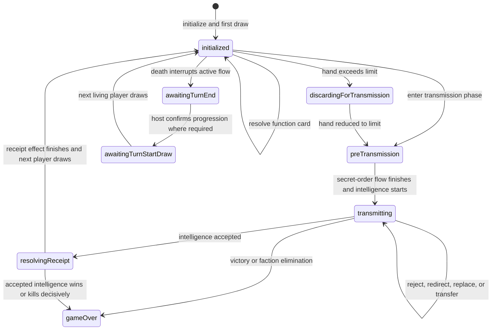
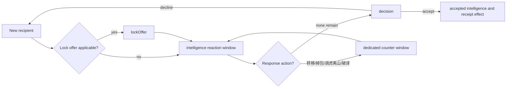

# Game engine architecture

Status: current implementation, documented July 2026.

This document describes the rules engine implemented primarily in
`src/game/engine.ts` and the physical card manifest in `src/game/cards.ts`. It
describes how the code works today, including known architectural debt. Rule
meanings remain authoritative in [rules-decisions.md](rules-decisions.md).

## Responsibilities and boundary

The engine owns deterministic game behavior:

- physical deck selection, faction assignment, and seeded randomness;
- turn, transmission, receipt, death, and victory state transitions;
- validation and execution of every legal game action;
- response order and card-effect resolution;
- physical-card conservation;
- public audit entries and private card notices;
- privacy-safe player and spectator projections;
- server-generated `legalActions`.

The engine does not own rooms, sockets, reconnect tokens, wall-clock timers,
bot delays, display names, or host settings. Those are application-layer
responsibilities.

Engine commands mutate one `GameState` synchronously. Public functions reject
invalid commands by throwing before returning. `GameSessionService` provides
the outer transactional checkpoint and rollback boundary.

## Determinism

`initializeGame(playerIds, seed)` uses seeded randomness for faction order,
deck order, and the first active player. The seed-derived `randomState` then
advances whenever later rules need randomness, such as random card selection
or reshuffling.

No wall-clock data is stored in `GameState`. Given the same initialized state
and command sequence, engine results are reproducible.

## Top-level state

`GameState` contains five broad categories:

| Category | Important fields | Purpose |
| --- | --- | --- |
| Game identity | `mode`, `seatOrder`, `activePlayerId` | Stable seat and mode information |
| Physical zones | `drawPile`, player hands and intelligence, `publicDiscard`, `hiddenSecretOrders`, `removedProbes`, `transmission.cardId` | Exactly one location for every physical card |
| Turn/effect state | `phase`, `transmission`, `pendingPublicTextReceipt`, `pendingSecretOrder`, `activeFunctionAction` | Current rule-level operation |
| Response state | `reactionWindow`, `interactionStack`, `activeFunctionStack`, `secretOrderStack`, `burnContexts` | Passing order, counter chains, snapshots, and nested effects |
| Outputs and support | `winner`, `auditLog`, `privateNotices`, `randomState`, `nextInteractionSequence` | Results, player-visible history, and deterministic support |

Player IDs, not display names, are stored in the engine. The room layer maps
them to display names for rendering.

## Physical card zones

Physical cards are identified by unique `PhysicalCardId` values from the card
manifest. The conservation invariant constructs the complete set of cards for
the current player count and requires every card ID to occur exactly once in
one of these locations:

- draw pile;
- a player's hand;
- a player's accepted intelligence;
- public discard;
- hidden resolved `秘密下达` cards;
- removed `试探` cards;
- the currently transmitted intelligence.

When the draw pile is empty, public discards and hidden secret orders are
combined, shuffled with `randomState`, and returned to the draw pile. Removed
probes and accepted intelligence are not recycled.

### Current resolving-card representation

There is no semantic resolving-card zone today. Most played function and
response cards are immediately placed in `publicDiscard`, even while their
effect is awaiting responses. Their frame also references the same card ID,
but the frame is not counted as a physical zone.

Exceptions have special destinations:

- a played `秘密下达` enters `hiddenSecretOrders` immediately;
- a played `试探` is moved from temporary public discard to `removedProbes`;
- the intelligence being transmitted lives at `transmission.cardId`;
- a successful `公开文本` function card moves from temporary public discard
  into the target's hand;
- a successful `掉包` card moves from temporary public discard into
  `transmission.cardId`, while the replaced intelligence becomes discarded.

The player and spectator projections currently hide a pending function-card
`公开文本` from the displayed discard pile. This projection filter corrects
the visible behavior but does not change its internal temporary location.
Replacing this temporary-discard convention is a goal of the planned
[resolution stack refactor](resolution-stack-refactor.md).

## Turn and phase state machine

The `phase` field controls the broad command family that may execute.

The death-resolution paths can clear unresolved turn state and use the two
`awaiting...` phases to avoid silently performing a decision that still belongs
to the host or the next turn transition.

## Functional-card flow

During `initialized`, the active player may play implemented functional cards
while retaining at least one card for transmission.

`activeFunctionAction` stores the rule payload:

- function kind and source card/player;
- original and current target;
- whether `离间` has already been used;
- whether the action is countered;
- whether it is responding or awaiting a target/source choice.

`activeFunctionStack` stores the original function frame followed by any
`离间` and `识破` frames. Each frame contains a snapshot sufficient to reverse
the effect immediately when countered. After all responders pass,
`finishActiveFunctionAction` either cancels the effect or performs the
function-specific resolution.

Some functions then wait for a private follow-up command, such as choosing a
`危险情报` discard or responding to a `试探`. During those stages the response
window and response stack are already finished, but `activeFunctionAction`
continues to own the pending choice.

## Pre-transmission and secret orders

Entering transmission first creates `pendingSecretOrder` in `preTransmission`:

1. Other living players are offered `秘密下达` in seat order.
2. If one is played, its declared word and server-known color restriction are
   recorded and a `secretOrderStack` counter chain opens.
3. After responses, the active player selects matching intelligence or asks
   the server to verify that no matching card exists.
4. The active player then starts transmission.

The source and target receive appropriate private card information. A verified
no-match claim records a persistent private hand snapshot for the source. The
required color is projected only to entitled participants.

## Transmission and receipt lifecycle

`TransmissionState` owns one physical intelligence while `phase` is
`transmitting`. Important fields include:

- sender, method, direction, and intended recipient;
- whether the intelligence returned to its sender;
- `interceptorCommitted` and `transferredRecipientCommitted` acceptance
  obligations;
- receipt-cycle number and receipt stage;
- lock state and whether the lock offer was consumed;
- face-up/decryption visibility;
- pending `转移`, `掉包`, `调虎离山`, or `破译` payloads.

Each recipient begins a receipt cycle:

Dedicated windows isolate whether the just-played action is countered. When an
action resolves, a new full intelligence reaction round opens when required.
For example, successful `转移` starts a new receipt cycle for its target; a
countered `掉包` restores state and restarts the intelligence reaction round.
A countered `调虎离山` instead restores the original intelligence window and
the response position from which it was played, so players who had already
passed are not prompted again.

`interactionStack` contains transmission response frames for `截获`, `转移`,
`离间`, `识破`, `锁定`, `掉包`, `调虎离山`, and `破译`. Frames contain a full
`ReversibleInteractionSnapshot` of receipt-relevant transmission state.
`调虎离山` also records the original reaction window so a successful counter
can restore its exact response priority.
Playing `识破` restores the target frame's snapshot immediately and pushes a
new counter frame containing the state from before that restoration. This
supports arbitrary counter depth without parity-specific code.

## Reaction windows

The single global `reactionWindow` identifies:

- the window kind;
- the player affected by the current action;
- a complete responder order;
- the index of the current responder.

Responder order begins with the next living player after the affected player
and ends with the affected player. All eligible living players are prompted,
even when the server knows their hand contains no usable response, preserving
hidden-information timing.

`passReaction` advances the index. When the final responder passes,
`finishPassedReactionWindow` dispatches by window kind to resolve the pending
action or advance the receipt/function/secret-order state machine.

## Burn nesting

`烧毁` may interrupt an ordinary action or another response window and may
itself be answered by `识破` or another nested `烧毁`.

Each `BurnContext` owns:

- the burn source and target intelligence;
- its countered state and counter frames;
- a clone of the suspended global reaction window;
- a flag indicating whether that suspended window became complete while burn
  was resolving.

`burnContexts` is an array because nested burns can be unresolved
simultaneously. Resolving the top burn pops it, applies or cancels destruction,
restores the cloned parent window, and either resumes or completes the parent.
This works but duplicates continuation ownership across `reactionWindow` and
the burn context.

## Acceptance, death, and victory

Acceptance moves `transmission.cardId` into the recipient's intelligence and
logs the card's color and transmission method. Three black intelligence cards
kill the recipient and reveal their faction. Accepted `公开文本` may then create
`pendingPublicTextReceipt` for a mandatory or chosen draw/discard effect.

Victory is checked immediately when relevant:

- `军情` wins through three blue intelligence;
- `潜伏` wins through three red intelligence;
- an individual `特工` wins through six intelligence;
- faction elimination can end the game when only one eligible faction remains.

Game end clears or settles unresolved state according to the physical-card and
public-information rules, reveals factions through projection, and prevents
further gameplay commands.

## Invariants

`assertGameStateInvariants` is called after initialization and successful state
transitions, and before projection. It validates, among other things:

- player count, seat identity, faction distribution, and active-player life;
- exact physical-card conservation and valid deck membership;
- phase/pending-state correspondence;
- responder membership, order, and current index;
- agreement between each window kind and its owning pending action/stack;
- card name, player identity, target linkage, and snapshot validity for frames;
- unique interaction/frame IDs and valid counter targets;
- transmission commitments and pending response consistency;
- death, winner, and game-over consistency;
- privacy notice references and pending receipt choices.

The invariant checker is intentionally strict: state-shape mistakes should fail
near the command that created them rather than appear later as UI corruption.

## Projection and privacy

The engine never sends `GameState` directly to clients.

`projectGameForPlayer(state, viewerId)` returns:

- the viewer's faction and full hand;
- public player fields, accepted intelligence, discard, and audit log;
- hidden transmission cards only when face-up or privately visible;
- viewer-specific private notices and inspection snapshots;
- a simplified response stack and current responder;
- only pending information the viewer is entitled to know;
- the complete list of commands currently legal for that viewer.

`projectGameForSpectator` contains public information only and no legal actions.
Hands become public after game end. Projection clones physical card records so
clients cannot mutate the manifest or authoritative state.

Legal actions are generated from authoritative state rather than reconstructed
by the client. The UI may further group or present them, but submission is still
validated again at the engine command boundary.

## Current coupling and known debt

The main refactoring pressures are:

- four separate frame/context stores with similar counter behavior;
- a global reaction window whose owner depends on its `kind`;
- duplicated counter validation and frame construction;
- `finishPassedReactionWindow` acting as a central kind switch;
- nested burn requiring cloned suspended windows;
- projections and server timers selecting stacks with their own kind switches;
- unresolved cards temporarily living in terminal zones;
- pending payloads split between transmission, functional, secret-order, and
  burn structures.

These are implementation concerns, not permission to alter confirmed rules.
